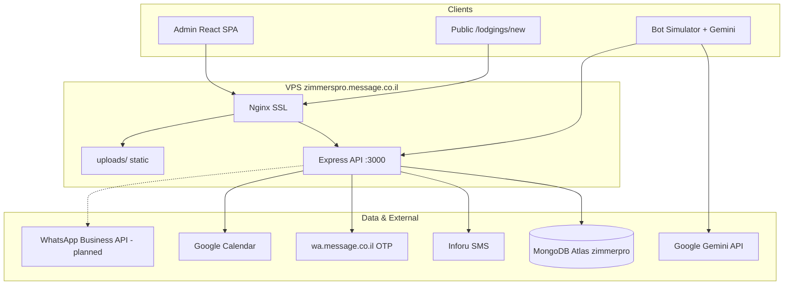

TzimmerPro conent
15.24 KB •361 lines
•
Formatting may be inconsistent from source

# ZimmerPro — Full Project Report

**ZimmerPro AI** (`zimmerpro-ai---smart-management-system`) is a **vacation rental / “zimmer” (Israeli guesthouse) management platform** with an **AI-assisted booking flow** aimed at WhatsApp-style guest communication. It sits under your **GlobalBot** workspace and is deployed at **https://zimmerspro.message.co.il**, tied to the **message.co.il** ecosystem (phone auth, SMS, likely WhatsApp infra).

---

## 1. Business overview

### What the product does

ZimmerPro is a **B2B SaaS-style admin panel** for lodging operators in Israel, with:

| Area | Purpose |
|------|---------|
| **Property management** | Units (zimmers), rooms, facilities, images, seasonal pricing |
| **Operations** | Bookings, calendar, contacts, reviews |
| **Multi-tenant accounts** | “Complex owners” manage multiple properties via **Accounts** |
| **Guest acquisition** | Public onboarding at `/lodgings/new` for new owners/clients |
| **Automation (planned/partial)** | Gemini-powered “WhatsApp bot” for search → book flow |
| **Integrations** | Google Calendar sync, WhatsApp Business API config, SMS/voice OTP |

### Target users (roles)

Defined in `types.ts` and enforced in UI + backend:

| Role | Business meaning | Typical access |
|------|------------------|----------------|
| **admin** | Platform operator | Full system, user approval, settings, deploy button |
| **zimmer_owner** | Single-property owner | Own units (linked to user) |
| **complex_owner** | Multi-property operator | Units via **Accounts** |
| **manager** | Staff (partial) | Similar to owners in auth middleware |
| **client / customer** | End guest or light user | Bookings + calendar only; limited until approved |

**Approval gate:** New users register with `isApproved: false`. Until an admin approves them, they only see **Bookings** (not dashboard, units, bot, etc.) — a clear **onboarding / vetting** model for a managed platform.

### Business model signals (inferred)

- **Per-account limits**: `Account.maxUnits` caps inventory per business.
- **Operator branding**: Account logo, WhatsApp number, contacts.
- **Regional targeting**: Units have Israeli regions (`צפון`, `דרום`, `מרכז`, `השפלה`).
- **Hebrew-first**: Default language Hebrew; EN/AR supported — fits Israeli domestic market with tourism.

### Differentiator (stated vs built)

**Marketing (metadata.json, README):** “Smart WhatsApp bot integration, booking analytics, automated guest communication.”

**Reality today:**

- **Bot Simulator** — full Gemini function-calling demo in the browser; creates real bookings via API.
- **Live WhatsApp** — configuration UI + example webhook code; **no production webhook** in this repo’s main server.
- **Integrations page** — commented out in sidebar; content is documentation/sample code.

So the **core PMS (property management)** is relatively mature; the **WhatsApp production bot** is the strategic layer still being wired (likely via GlobalBot / `wa.message.co.il`).

### Public funnel

`/lodgings/new` (`PublicLodgingsPage`) — standalone flow for **phone OTP or Google login**, then units/bookings for clients. This supports **self-service listing** or guest portals without the full admin shell.

---

## 2. Technology stack (summary)

| Layer | Technology |
|-------|------------|
| **Frontend** | React 19, TypeScript, Vite 6, Tailwind (CDN), Lucide icons, Recharts |
| **Backend** | Node.js, Express 4, ES modules |
| **Database** | MongoDB Atlas (`zimmerpro` DB) via Mongoose 9 |
| **Auth** | JWT (Bearer), bcrypt passwords, Google OAuth, phone/email OTP |
| **AI** | Google Gemini (`@google/genai`, model `gemini-3-flash-preview`) — **client-side** in simulator |
| **SMS** | Inforu API (Israel) |
| **Voice/phone OTP** | `wa.message.co.il/phone-auth.php` |
| **Calendar** | Google Calendar API (OAuth tokens on User) |
| **Hosting** | VPS (~103.95.119.188), Nginx reverse proxy, PM2, Let’s Encrypt |
| **Process manager** | PM2 (`ecosystem.config.js`) |

---

## 3. Frontend architecture

### Structure

- **SPA** with tab-based routing (no React Router) — `activeTab` state in `App.tsx`.
- **Global state**: `AppState` in memory (`db.ts` starts empty; data loaded per page from API).
- **API client**: `api.ts` — `fetch` to `VITE_API_URL` or `http://localhost:3000/api`, JWT in `localStorage`.

### Pages

| Page | Function |
|------|----------|
| `AuthPage` | Login/register (email, Google, phone OTP, email OTP) |
| `Dashboard` | KPIs, charts (monthly income, bookings) |
| `UnitsPage` | CRUD lodgings, images, pricing, facilities |
| `BookingsPage` | Reservation management |
| `CalendarPage` | Calendar view of bookings |
| `BotSimulator` | AI guest conversation + tool calls → bookings |
| `ReviewsPage` | Guest reviews per unit |
| `ContactsPage` | Account contacts |
| `FacilitiesPage` | Amenities catalog |
| `AccountsPage` | Business accounts (complex owners) |
| `UsersPage` | Admin user management + **impersonation** |
| `SettingsPage` | Stats, Google Calendar, WhatsApp API keys, reset data |
| `IntegrationsPage` | WhatsApp webhook documentation (menu disabled) |
| `PublicLodgingsPage` | Public `/lodgings/new` onboarding |

### i18n & UX

- **Languages:** Hebrew (default), English, Arabic — `translations.ts`, RTL/LTR via `dir`.
- **Font:** Heebo (Hebrew-friendly).
- **Design:** Slate/indigo admin UI, sidebar navigation, responsive.

### Admin features

- **Impersonation:** Admin can “view as” another user (`originalAdminUser` in state).
- **Deploy button:** UI-only simulation (`handleDeploy` timeout) — not a real CI deploy from FE.

### Frontend ↔ backend coupling

- Most entities fetched on demand per page (not a global React Query layer).
- `mongoose` appears in **root** `package.json` but FE uses API only (`db.ts` comment: “all data from MongoDB via API”) — root mongoose is likely unused on FE.

---

## 4. Backend architecture

### Layered design (numbered folders)

```
backend/
├── 1-server-express.js    # Entry: CORS, static uploads, route mount
├── 2-routers/             # Express routes
├── 3-controllers/         # HTTP handlers
├── 4-services/            # Business logic
├── 5-repositories/        # Data access
├── models/                # Mongoose schemas
├── middleware/            # auth.js, authorization.js, errorHandler.js
└── utils/                 # JWT, password fix, IP check
```

This is a clean **router → controller → service → repository** pattern.

### API surface (`/api/*`)

| Route group | Resources |
|-------------|-----------|
| `/api/auth` | register, login, google, me, phone OTP, email OTP |
| `/api/users` | User CRUD |
| `/api/units` | Lodging units |
| `/api/bookings` | Reservations |
| `/api/accounts` | Business accounts |
| `/api/contacts` | Contacts |
| `/api/facilities` | Amenities |
| `/api/reviews` | Reviews |
| `/api/rooms` | Room breakdown per unit |
| `/api/settings` | stats, Google Calendar, WhatsApp config, admin reset |
| `/api/upload` | Base64 image upload → `backend/uploads/` |

**Static files:** `/uploads/*` served from disk (Nginx also proxies these in production).

### Auth flow

1. **JWT** issued on login/register/OTP success (`utils/jwt.js`).
2. **`authenticate` middleware** loads user from token on protected routes.
3. **`authorize('admin')`** for destructive admin actions (e.g. reset data).

### Authorization model (data scoping)

`unitService.getAllUnits` filters by **`UserSettings.ownerType`**:

- **admin** → all units  
- **zimmer_owner** → `linkType: 'user'`, `linkedToId: user._id`  
- **complex_owner** → units linked to any **Account** owned by user  
- **client** → none  

Units use **polymorphic linking**:

```13:28:backend/models/Unit.js
  linkType: {
    type: String,
    enum: ['user', 'account'],
    required: true
  },
  linkedToId: {
    type: mongoose.Schema.Types.ObjectId,
    required: true,
    refPath: 'linkTypeModel'
  },
```

**Note:** `middleware/authorization.js` still references legacy `accountId` / `userId` on units in places — possible drift from the newer `linkType` / `linkedToId` model (technical debt / bug risk).

### Notable services

| Service | Role |
|---------|------|
| `authService.js` | Registration, OTP (in-memory Maps), Google, admin notifications |
| `bookingService.js` | Bookings + optional Google Calendar sync |
| `googleCalendarService.js` | OAuth, event create/update |
| `smsService.js` | Inforu SMS for OTP |
| `settingsService.js` | Platform stats, WhatsApp tokens on Account |

---

## 5. Database (MongoDB)

### Connection

- **Atlas cluster:** `zimmerpro.bz5fbvt.mongodb.net`, database name **`zimmerpro`**.
- **Intended config:** `MONGODB_URI` in `.env`.
- **Critical issue:** `backend/5-repositories/db.js` currently **hardcodes** a full connection string (credentials in source). `env.example` and `DEPLOYMENT.md` also contain real-looking secrets. This should use **only** `process.env.MONGODB_URI` and secrets must be **rotated** if the repo was ever shared.

### Collections (Mongoose models)

| Collection | Main fields / relationships |
|------------|----------------------------|
| **users** | name, email, phone, password (bcrypt), role, `userSettingsId` (required), `isApproved`, Google tokens, `preferredLanguage` |
| **usersettings** | `ownerType`, `numberOfComplexes` |
| **accounts** | business profile, `userId` → User, `maxUnits`, `whatsapp_number` (+ tokens via settings service) |
| **units** | `linkType` + `linkedToId`, pricing, capacity, status, images, `specialPrices`, `region`, `facilityIds` |
| **bookings** | `unitId`, guest info, dates (strings), `status`, `googleSynced`, `googleCalendarEventId` |
| **rooms** | per-unit room details (beds, jacuzzi, etc.) |
| **facilities** | amenities by `accountId` |
| **contacts** | people tied to accounts |
| **reviews** | unit reviews, publish flag |
| **settings** | legacy/global settings (alongside UserSettings) |

### Data conventions

- `_id` exposed to FE as **`id`** via `toJSON` transforms.
- Dates often stored as **ISO date strings** (`YYYY-MM-DD`), not always `Date` types.
- `booking.unitId` is **String**, not ObjectId ref — works but weaker referential integrity.

### Seed / migration

- `mongodb_insert_script.js` — commented sample data for manual seeding.
- `backend/scripts/fix-user-settings.js` — maintenance for UserSettings linkage.

---

## 6. AI & WhatsApp (product + tech)

### Bot Simulator (working demo)

`geminiService.ts` runs **in the browser** with `VITE_GEMINI_API_KEY`:

- System prompt defines a **strict booking funnel**: name → dates → search → select → phone → fake card digits → `create_booking`.
- **Tools:** `search_available_units`, `create_booking`.
- `BotSimulator.tsx` executes tools locally (availability check against in-memory bookings) and POSTs new bookings to API.

**Implication:** Gemini key is exposed to clients if used in production builds — production WhatsApp should call Gemini **server-side only**.

### Live WhatsApp (not fully implemented here)

- Admin stores WhatsApp Business credentials via **Settings → WhatsApp API** (stored on Account).
- `IntegrationsPage` shows Meta webhook + Gemini sample.
- `example-nodejs-backend.js` — separate webhook sketch.
- Phone auth uses **`https://wa.message.co.il/phone-auth.php`** — ties this product to your **message.co.il / GlobalBot** infrastructure.

---

## 7. Deployment & operations

| Item | Detail |
|------|--------|
| **Production URL** | `https://zimmerspro.message.co.il` |
| **Server path** | `/var/www/zimmerspro/` (backend + `dist` frontend) |
| **Backend port** | 3000 (internal) |
| **Nginx** | SSL, `/api` → Node, `/` → static React, `/uploads` proxied |
| **PM2** | App name `zimmerpro-api`, `1-server-express.js` |
| **Docs** | `DEPLOYMENT.md`, `NGINX-SETUP.md`, upload fix guides |
| **Dev** | `npm run dev:all` — FE :5173, BE :3000 |

---

## 8. Security & compliance (important)

Issues visible in the codebase (recommend fixing before any public audit):

1. **Hardcoded MongoDB password** in `db.js` (not using `.env`).
2. **Secrets in `env.example` / `DEPLOYMENT.md`** (Google client secret, JWT examples, DB password).
3. **Hardcoded Inforu SMS API credentials** in `smsService.js`.
4. **Default JWT secret** fallback in `auth.js` if `JWT_SECRET` unset.
5. **Gemini API key** intended for frontend (`VITE_*`) — key leakage risk.
6. **OTP storage in memory** — lost on restart; not multi-instance safe.
7. **CORS** permissive in development; production whitelist includes production domain.
8. **Demo “credit card” flow** in bot — not PCI-compliant; clearly demo-only.

---

## 9. Technical debt & gaps

| Area | Status |
|------|--------|
| WhatsApp production webhook | Documented, not in main Express app |
| Integrations menu | Commented out in `App.tsx` |
| Authorization middleware | May not match `linkType`/`linkedToId` unit model |
| FE Dashboard filters | Still references `unit.accountId` / `unit.userId` in places |
| Tests | None (`"test": "echo Error..."`) |
| `db.js` vs `MONGODB_URI` | Config drift |
| Health endpoint | Docs mention `/api/health`; server exposes `/api` status JSON |
| Payment | Simulated 4-digit card in bot only — no real payment gateway |

---

## 10. Relationship to GlobalBot

This repo lives at `GlobalBotSrc/zimmers-pro` and integrates with:

- **message.co.il** hosting and auth (`wa.message.co.il`)
- Likely the broader **GlobalBot** WhatsApp/messaging stack you are building

ZimmerPro is the **vertical SaaS UI + API** for zimmer operators; GlobalBot/message.co.il appears to be the **communications/auth platform** underneath.

---

## 11. Quick architecture diagram



---

## 12. Bottom line

**Business:** ZimmerPro is an **Israeli vacation-rental PMS** with multi-role tenancy, approval-based onboarding, and a roadmap centered on **AI + WhatsApp automated bookings**. The operational core (units, bookings, accounts, reviews, calendar) is implemented; the **differentiated WhatsApp agent** is partially delivered (simulator + config + external auth), not yet a single deployed webhook in this repo.

**Technology:** Modern **React + Express + MongoDB** monorepo with clear layering, production deployment on **message.co.il** infrastructure, and several **security and consistency issues** that should be addressed before scaling users or exposing Gemini keys.

If you want a follow-up, I can go deeper on any slice only (e.g. full API contract per endpoint, booking conflict rules, or a migration checklist for production WhatsApp) — still in Ask mode I can only analyze, not change the repo. Switch to **Agent mode** if you want remediation work (env-based DB, secret rotation, server-side Gemini, etc.).